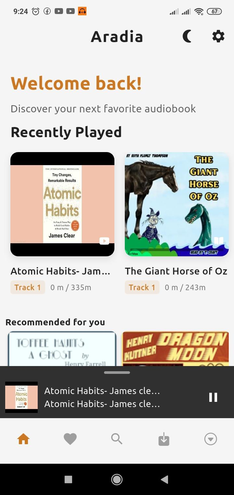
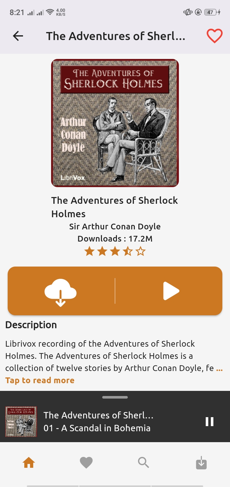
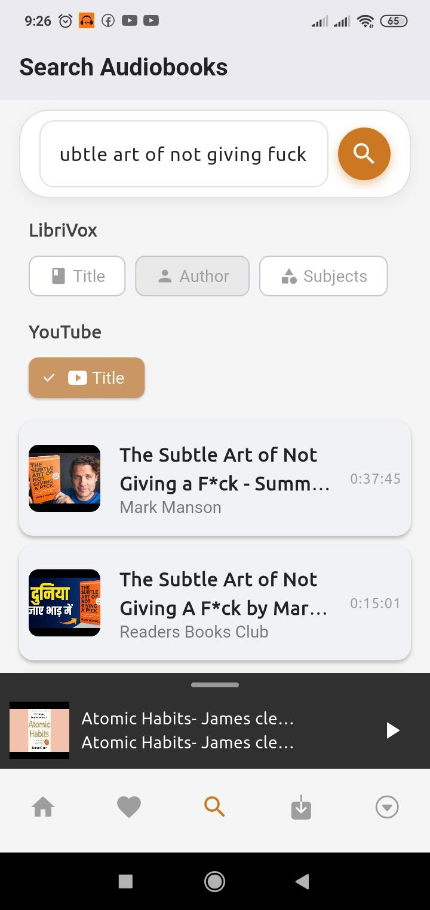
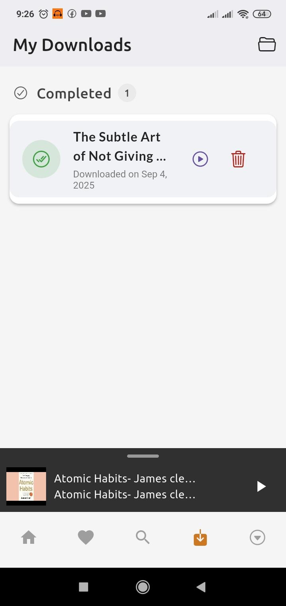
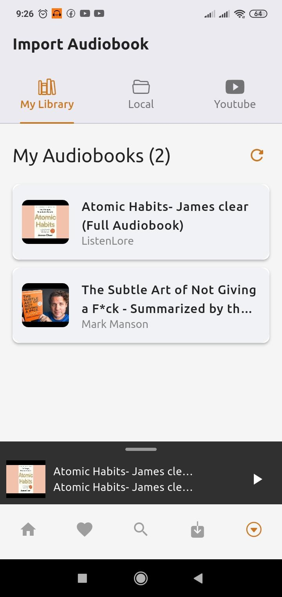
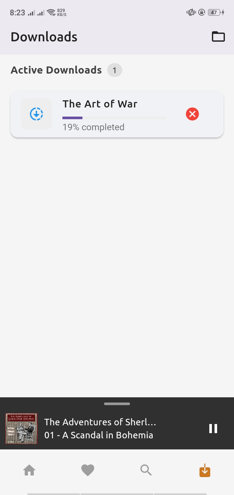

# 🎧 Aradia: Free Audiobooks


<p align="center">
  
  
  
  
</p>

---

## 📖 About Aradia

**Aradia** is a free, ad-free mobile application offering seamless access to over 20,000 audiobooks from Librivox using Archive.org API. **It can now also play Youtube videos as audiobooks**. Designed for literature enthusiasts and built with passion using **Flutter** and **Dart**. 

---
## Join Our Discord Community
[](https://discord.gg/QwTxRKC9UF)

## ☕ Support the Project
[](https://ko-fi.com/Y8Y61N3ERH)

## 📸 App Preview

<p align="center">
  
  
  
</p>

<p align="center">
  
  
  
</p>

---

## 📥 Download Now

<p align="center">
  <a href="https://github.com/sagarchaulagai/aradia/releases">
    
  </a>
</p>

---

## 🎧 Key Features

- 📚 **Extensive Library**: Access more than 20,000 free audiobooks
- 📥 **Offline Downloads**: Save and enjoy audiobooks without internet
- ❤️ **Wishlist**: Bookmark and curate your favorite titles
- 🎚️ **Customizable Playback**:
  - Adjust playback speed with precision
  - Skip silence for seamless listening
  - Add sleep timer
  - Enjoy background playback support
- 🔍 **Smart Search**: Discover audiobooks by title or author or related subjects
- 🎵 **Mini Audio Player**: Control playback from anywhere
- 🚫 **Ad-Free Experience**: Pure, uninterrupted listening pleasure
- 📺 **Youtube Support**: Play Youtube videos as audiobooks

---

## 🛠️ Development Setup

### Prerequisites

- Flutter SDK
- Device or emulator for testing

### Quick Start

```bash
# Clone the repository
git clone https://github.com/sagarchaulagai/aradia.git

# Navigate to project directory
cd aradia

# Install dependencies
flutter pub get

# Run the app
flutter run
```

---

## 🌟 Upcoming Innovations

1. **Podcast Support**: An Entire New Page for Podcasts
2. **Support https://audiobookbay.lu/** : App will be able to play torrent files from audiobookbay.lu

---

## 📄 Licensing

This project is open-sourced under the MIT License. For complete details, refer to the [LICENSE](LICENSE) file.

---