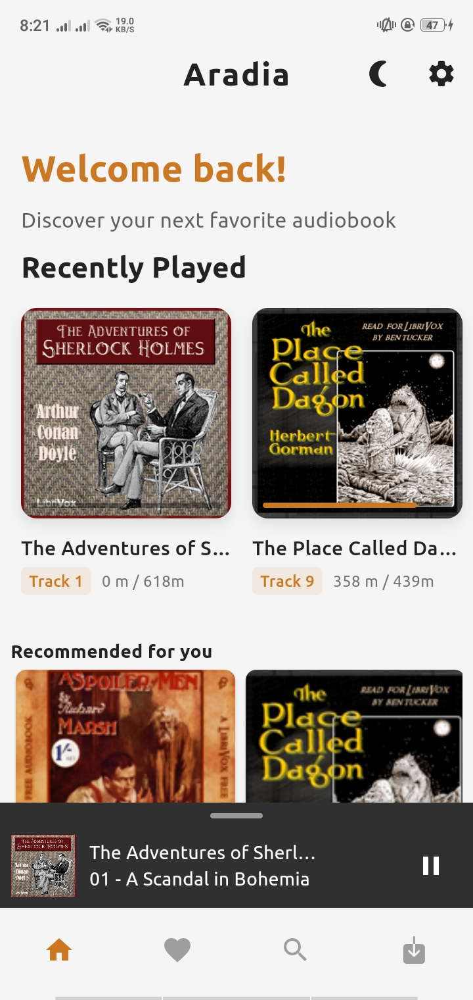
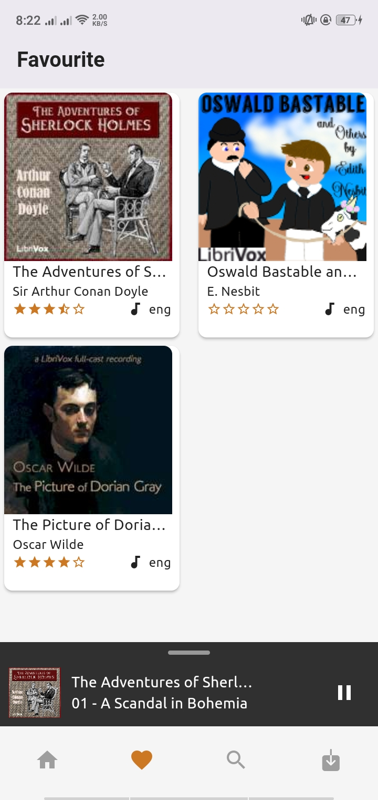
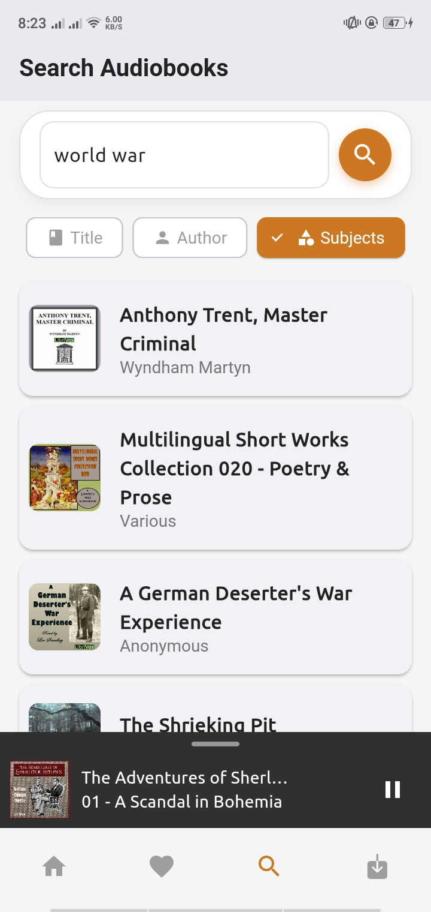

# 🎧 Aradia: Free Audiobooks


<p align="center">
  
  
  
  
</p>

---

## 📖 About Aradia

**Aradia** is a free, ad-free mobile application offering seamless access to over 19,000 audiobooks from Librivox using Archive.org API. Designed for literature enthusiasts and built with passion using **Flutter** and **Dart**.

---

## 📸 App Preview

<p align="center">
  
  
  
</p>

<p align="center">
  
  
  
</p>

---

## 📥 Download Now

<p align="center">
  <a href="https://github.com/sagarchaulagai/aradia/releases">
    
  </a>
</p>

---

## 🎧 Key Features

- 📚 **Extensive Library**: Access more than 19,000 free audiobooks
- 📥 **Offline Downloads**: Save and enjoy audiobooks without internet
- ❤️ **Wishlist**: Bookmark and curate your favorite titles
- 🎚️ **Customizable Playback**:
  - Adjust playback speed with precision
  - Skip silence for seamless listening
  - Add sleep timer
  - Enjoy background playback support
- 🔍 **Smart Search**: Discover audiobooks by title or author or related subjects
- 🎵 **Mini Audio Player**: Control playback from anywhere
- 🚫 **Ad-Free Experience**: Pure, uninterrupted listening pleasure

---

## 🛠️ Development Setup

### Prerequisites

- Flutter SDK
- Device or emulator for testing

### Quick Start

```bash
# Clone the repository
git clone https://github.com/sagarchaulagai/aradia.git

# Navigate to project directory
cd aradia

# Install dependencies
flutter pub get

# Run the app
flutter run
```

---

## 🚀 Quality Assurance

Our app has been meticulously tested to ensure:

- 🔧 Functional perfection
- 🌈 Smooth, intuitive user experience
- 📱 Broad device compatibility
- 🌐 Seamless Android and iOS support

---

## 🌟 Upcoming Innovations

- 🤝 Social Sharing Features
- 🎨 Personalization Options
  - Intelligent Recommendation Engine
  - Dark/Light Mode Themes
- 📊 Enhanced User Analytics

---

## 📄 Licensing

This project is open-sourced under the MIT License. For complete details, refer to the [LICENSE](LICENSE) file.

---
